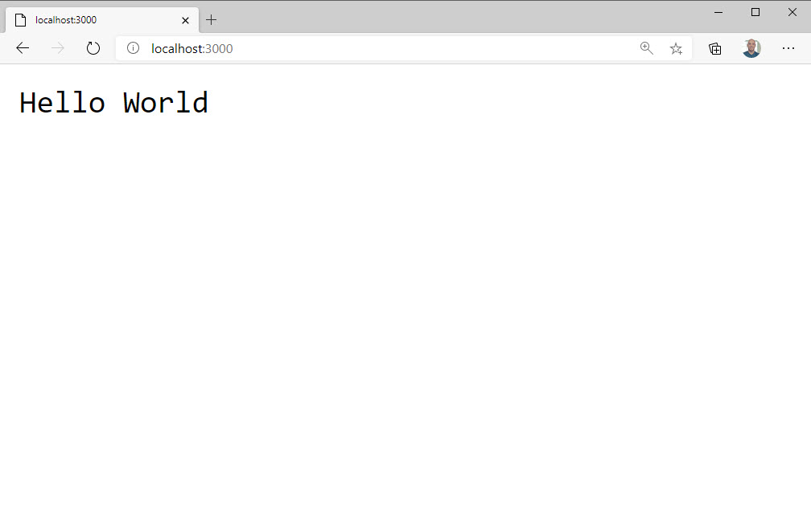

One of the most common use-cases for a JavaScript runtime is a web server. Web servers are a common way of exposing APIs and building fullstack data-driven applications.

The Deno standard library contains a `server` module that lets you implement in a web server in just a few lines of code.

- In the `app.ts` file, import the `server` module from the Deno standard library.

  ```typescript
  import { serve } from "https://deno.land/std/http/server.ts";
  ```

- Define `HOSTNAME` and `PORT` constants. For the `HOSTNAME`, we'll use 0.0.0.0, which is the same as saying "localhost" or "127.0.0.1", but is more compatible with things like Docker.

  ```typescript
  import { serve } from "https://deno.land/std/http/server.ts";
  const PORT = 3000;
  const HOSTNAME = "0.0.0.0";
  ```

- Use the `serve` function to create a new server object passing in the hostname and port constants.

  ```typescript
  import { serve } from "https://deno.land/std/http/server.ts";

  const PORT = 3000;
  const HOSTNAME = "0.0.0.0";

  const server = serve({ hostname: HOSTNAME, port: PORT });
  ```

- Use a `for` loop to start the server and listen for any incoming request. The body contains a simple response of "Hello World".

  ```typescript
  import { serve } from "https://deno.land/std/http/server.ts";

  const PORT = 3000;
  const HOSTNAME = "0.0.0.0";

  const server = serve({ hostname: HOSTNAME, port: PORT });

  console.log(`Server is now running on: http://${HOSTNAME}:${PORT}`);

  for await (const req of server) {
    req.respond({
      body: "Hello World",
    });
  }
  ```

- Run the program with `deno run app.ts`. It should tell you that permission is denied and that the `allow-net` flag is required.

  ```bash
  Check file:///home/burkeholland/dev/deno-first-look-exercises/app.ts
  error: Uncaught PermissionDenied: network access to "0.0.0.0:3000", run again with the --allow-net flag
  ```

Run the program again with the `allow-net` flag. Be sure to restrict the access to only port 3000.

    ```bash
    deno run --allow-net=0.0.0.0:3000 app.ts
    ```

The server should now be running on port 3000. When you visit it in the browser, you should see "Hello World".



## Returning HTML

Returning text isn't terribly useful, so instead, return some HTML.

    ```app.ts
    for await (const req of server) {
    req.respond({
      body: "<h1>Hello World</h1>",
    });

    }
    ```

## Parsing query parameters

Let's modify the HTML to return a hello message to whatever name we pass in as a query string parameter. To do that, we're going to need to look for the query string parameters on the req object.

    ```typescript
    for await (const req of server) {
        const name = new URLSearchParams(req.url.substring(1)).get("name");
        req.respond({
            body: `<h1>${name}</h1>`
        });
    }
    ```

The `req.url` object contains the URL fragment. If we look at it

That works, but it's not really the best way to go about returning HTML. It would be better if we built the HTML in a separate file and sent that file instead of just sending text.

- Create a new file called "index.html"
- Place the following code in that file

  ```html

  ```

```

```
